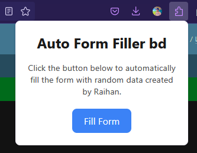

# Auto Form Filler Extension

A Firefox extension that automatically fills forms with random or predefined data. This extension is particularly useful for testing or filling out repetitive forms quickly.

## Features

- **Random Name Generation**: Fills the name field with a random Bangladeshi name.
- **Random Email Generation**: Generates an email based on the name field.
- **Random Phone Number**: Fills the phone field with a valid Bangladeshi phone number.
- **Random Address, City, District, and State**: Fills address-related fields with random Bangladeshi data.
- **Easy to Use**: Simply click the extension icon and press the "Fill Form" button.

## How to Use

1. **Install the Extension**:
   - Clone this repository or download the ZIP file.
   - Open Firefox and go to `about:debugging`.
   - Click on "This Firefox" and then "Load Temporary Add-on".
   - Select the `manifest.json` file from the downloaded folder.

2. **Fill Forms**:
   - Navigate to any webpage with a form.
   - Click the extension icon in the toolbar.
   - Click the "Fill Form" button to automatically fill the form fields.

## Screenshots

## Code Structure

- `manifest.json`: The manifest file for the extension.
- `popup.html`: The HTML for the extension's popup.
- `popup.js`: The JavaScript for handling popup interactions.
- `content.js`: The main script for filling forms.
- `README.md`: This file.

## Contributing

Contributions are welcome! If you have any suggestions, bug reports, or feature requests, please open an issue or submit a pull request.

## License

This project is licensed under the MIT License. See the [LICENSE](LICENSE) file for details.

---

Made with ❤️ by [Raihan](https://github.com/dhnraihan)